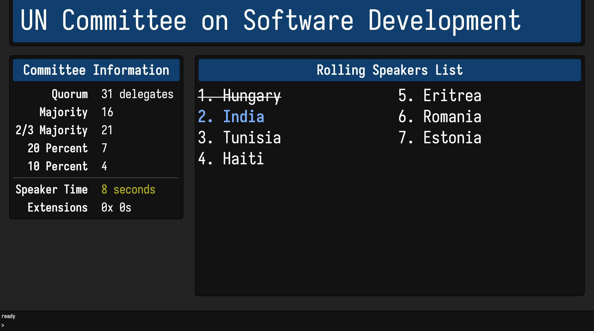

**disclaimer:** this fork is unfinished. for now, just assume nothing works —IR

# mun.track

mun.track is a Model UN committee dashboard.

### Try it out!

[https://theadder.org/muntrack](https://theadder.org/muntrack)

## The Theory

If you attended a Model UN conference, your committee chairs will probably use a
chalkboard or a Microsoft Word document to manage the general speakers lists,
the rolling speakers list, quorum, and speaking time. This is inefficient and
gets messy fast.

mun.track is a sleek online dashboard for your Model UN committee that
eliminates the pain. mun.track runs in any modern web browser and is designed to
be projected in front of your delegates.

## Operating instructions

mun.track is controlled by typing commands at the prompt at the bottom of the
screen. The learning curve is a bit steep, but

* once you learn the keyboard commands, you'll be whizzing around much faster
  than you could with a mouse
* the command-line is the only interface discreet enough to not disrupt your
  delegates.

To run a command, simply type its name and press `&lt;enter>`. Then follow any
relevant prompts.

### Available commands

| command     | shortcut | description                                          |
|-------------|----------|------------------------------------------------------|
| `help`      | `?`      | Display this table                                   |
| `settitle`  | `sh`     | Set title                                            |
| `setquorum` | `sq`     | Set quorum                                           |
| `settime`   | `st`     | Set speaking time                                    |
| `setexts`   | `se`     | Set speaking extensions                              |
| `add`       | `a`      | Add delegates to current speakers list               |
| `insert`    | `i`      | Insert delegate into current speakers list           |
| `change`    | `c`      | Change delegate in current speakers list             |
| `flip`      | `f`      | Flip delegates in current speakers list              |
| `delete`    | `d`      | Remove delegates from current speakers list          |
| `next`      | `n`      | Advance speakers list                                |
| `prev`      | `p`      | Return to previous delegate in speakers list         |
| `switch`    | `s`      | Switch between rolling/general/voting speakers list  |
| `vote`      | `v`      | Enter voting procedure                               |
| `extend`    | `e`      | Extend current delegate's speaking time              |
| `timer`     | `t`      | Start large timer (for caucuses)                     |
| `mod`       | `m`      | Enter a moderated caucus (not fully implemented yet) |
| `spacebar`  | n/a      | Start/stop speaking timer                            |

### Display configuration

mun.track is designed for you to sit facing your committee with your laptop open
and mun.track projected behind you. We recommend you enable the "mirror
displays" option to project exactly what appears on your screen so you're aware
of what your delegates can see.

## Notes on the original mun.track

The original mun.track was developed by Nikhil Benesch, whose website is unfortunately lost to the sands of time.
The code is still there, however, at [benesch/mun.track](https://github.com/benesch/mun.track).

Changes from the original mun.track:
* The mun.track UI has been redesigned according to flat design principles.
* A number of bugs have been addressed and fixed:
  * On Firefox, the "help" dialog no longer automatically opens the GitHub repository when triggered from the command
line.
  * Timers no longer accept "0:00" as a valid time; this was causing issues.
  * The commandline no longer has that attention-grabbing blue outline.

## Contributing

We love contributions! See [CONTRIBUTING](CONTRIBUTING.md).

## License

mun.track is free software: free to use, free to modify, and free to distribute
under the terms of the [Affero GNU General Public License, version 3][agpl].

Essentially, should you choose to modify mun.track and make available a website
hosting your modified version, all users must be provided with the opportunity
to obtain your modified source code.

[agpl]: http://www.gnu.org/licenses/agpl-3.0.html
